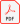

### Publications

This is a list of all my publications in chronological and alphabetical order. For a more thematic ordering and some context, see the research site.



<b style="cursor:pointer;">Dissertation</b>

<ol start="{{ pubCounter }}">

<li> Victor Lamas. <a href="assets/papers/diss.pdf" target="_blank" rel="me noopener noreferrer"><b>TODO</b></a> TODO </li>
</ol>

<b style="cursor:pointer;">Journal Articles</b>



{{ pub.year }}


</ol>


<b>{{ this_year }}</b>
<ol start="{{ pubCounter }}">

  
<li style="margin: 5px;">{{ pub.author }}: <a href="assets/papers/{{ pub.id }}.pdf" target="_blank" rel="me noopener noreferrer"><b>{{ pub.title }}</b></a> {{ pub.journal }}, {{ pub.pages }}, {{ pub.year }}. doi: {{ pub.doi }} </li>


</ol>

<b style="cursor:pointer;">Conference & Workshop Papers</b>



{{ pub.year }}


</ol>


<b>{{ this_year }}</b>
<ol start="{{ pubCounter }}">

  
<li style="margin: 5px;">{{ pub.author }}: <a href="assets/papers/{{ pub.id }}.pdf" target="_blank" rel="me noopener noreferrer"><b>{{ pub.title }}</b></a> {{ pub.booktitle }}, {{ pub.publisher }}, {{ pub.year }}.  doi: {{ pub.doi }}  link: {{ pub.link }}  </li>


</ol>

